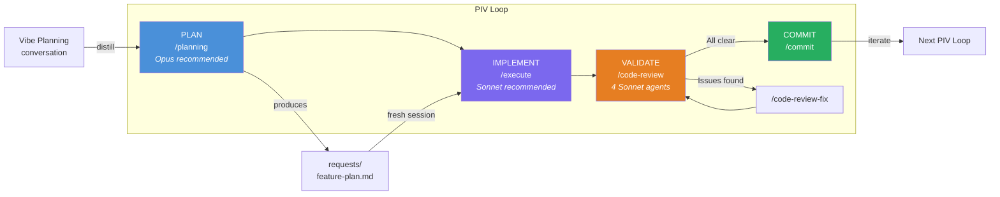
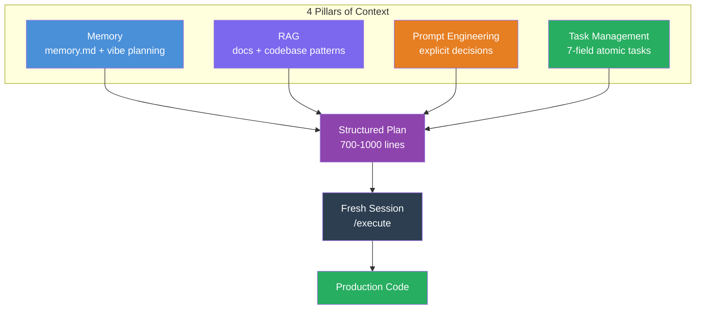
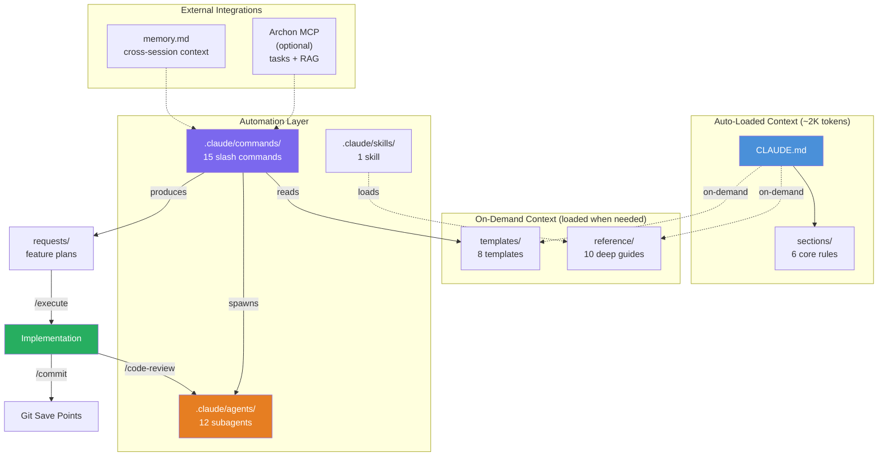
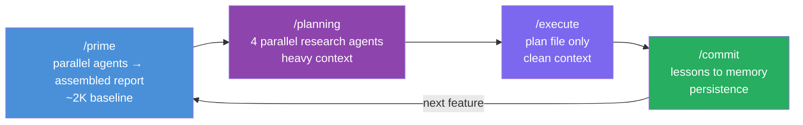
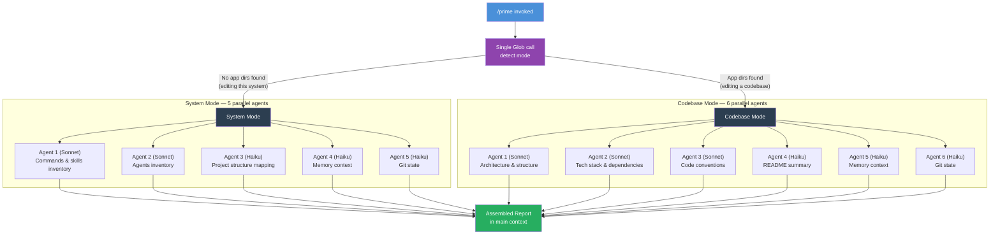
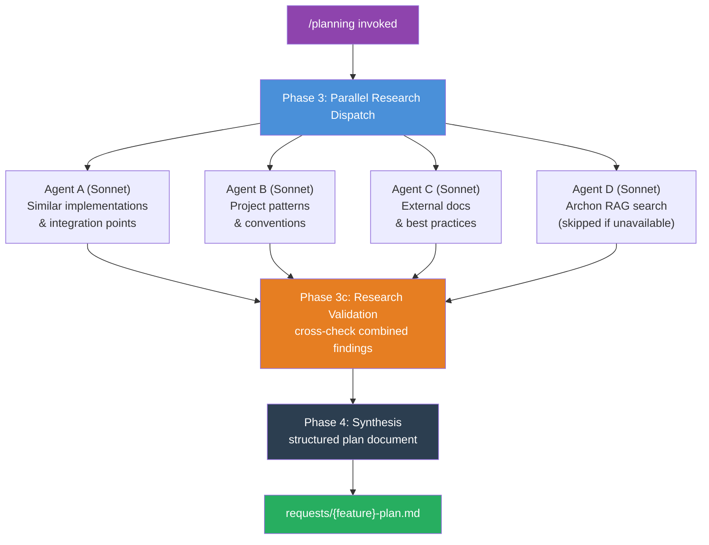
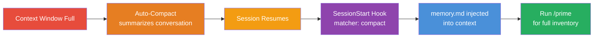
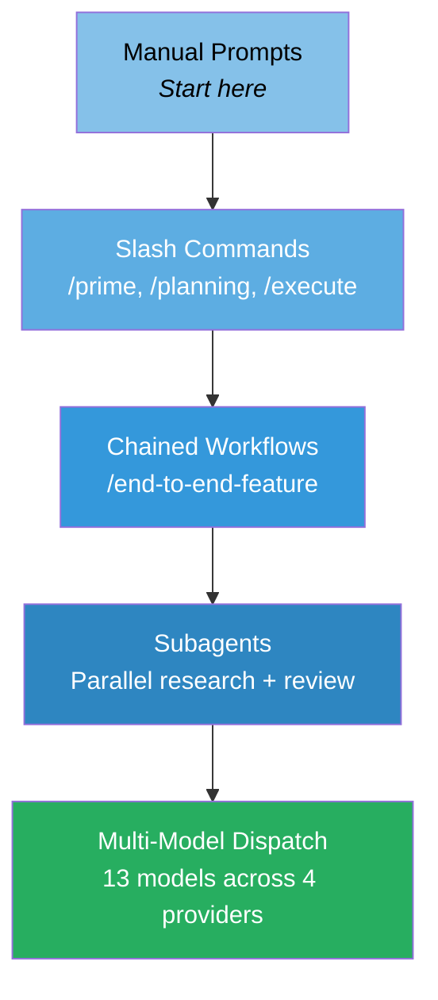
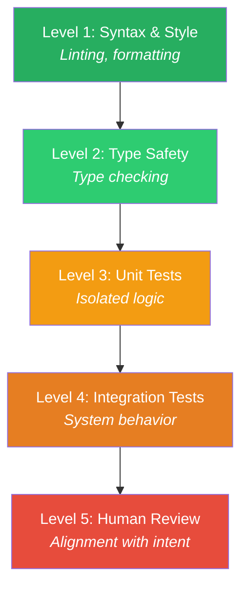
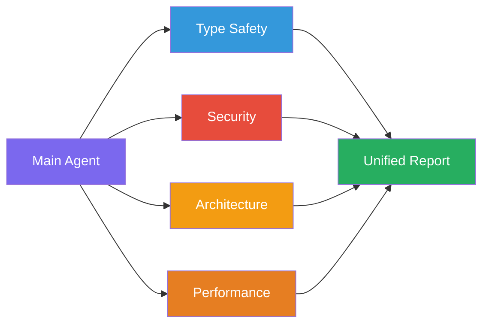

# OpenCode Coding System

**Stop guessing. Start engineering. Ship with confidence.**

A self-learning, self-reviewing development methodology powered by AI agents, multi-model dispatch, and automated bug detection. Built for [Claude Code](https://claude.ai), powered by the PIV Loop + 5-Tier Model Cascade, and battle-tested across real projects.

[](LICENSE)

---

## The Problem

AI coding tools are powerful, but without structure they produce inconsistent results. Give the AI too little context and it guesses. Give it too much and it drowns. Ask it to build a feature without a plan and you get code that works in isolation but breaks everything around it.

Most developers use AI like a magic 8-ball: ask a question, hope for a good answer, and manually clean up when it isn't.

**This system fixes that.** It manages context automatically, enforces a plan-first workflow, and gives you quality gates at every stage.

---

## What This Is (and Isn't)

This is **not** an application. There's no source code, no build system, no runtime.

This is a **development methodology**: a structured collection of slash commands, templates, reference guides, and automation that wraps around OpenCode and turns it into a reliable development workflow. You clone this system, then build your applications inside it (or copy it into existing projects).

### Who Is This For?

- **Solo developers using OpenCode** who want consistent, production-grade output instead of trial-and-error prompting
- **Teams adopting AI workflows** who need a repeatable methodology, not ad-hoc prompting
- **Anyone tired of AI inconsistency.** The difference between 30% and 88% code acceptance is context clarity, not AI intelligence

### What You Get

- **17 slash commands** that automate every phase of development, from planning to commit
- **5 AI subagents** for research, code review, and memory curation
- **8 templates** for plans, PRDs, and agents — only the ones you will actually use
- **16 reference guides** loaded on-demand, consolidated and focused
- **1 skill** for systematic planning methodology
- **3 custom tools** for multi-model dispatch, batch comparison, and 13-model council debates
- A token-conscious architecture that keeps <10K tokens of system context, leaving the rest for your actual work

---

## The Philosophy: Less Is More

This system went through two rounds of cleanup, removing **55+ files** across commands, skills, references, templates, and config. Here is why:

**What was removed:**
- 6 reference guides consolidated into others: one authoritative source per topic
- 9 speculative templates nobody used (YAGNI applied to documentation)
- Features with no active use: cross-CLI orchestration, worktrees, agent teams, GitHub automation, remote system guides, MCP skills guides
- Config files for unused tools (CodeRabbit, githooks, opencode)

**What you get instead:**
- **Less cognitive load:** fewer files means less to explore and understand
- **No redundancy:** one guide per topic, not three overlapping ones
- **Faster context loading:** smaller codebase = faster AI comprehension
- **Easier maintenance:** fewer files to keep in sync
- **Focused documentation:** only what is actually used, nothing speculative

The best documentation is documentation you can trust. When every guide is essential, you know where to look.

---

## The PIV Loop

Every feature follows the same cycle: **Plan**, **Implement**, **Validate**, then iterate.



**Why fresh sessions matter.** Planning creates exploration context: options considered, tradeoffs weighed, research gathered. Execution needs clean context, not exploration baggage. The plan distills that into execution instructions. A fresh session with only the plan means the AI focuses on building, not rediscovering. *Vibe planning is good, vibe coding is not.*

**Multiple small loops.** Do not build entire features in one pass. Each PIV loop covers one feature slice, built completely before moving on. Complex features (15+ tasks, 4+ phases) auto-decompose into sub-plans via `/planning`, each getting their own loop.

**The handoff.** The plan is the bridge between thinking and building: 700-1000 lines capturing architecture decisions, file paths, code patterns, gotchas, and atomic tasks. Each task has 7 fields (ACTION, TARGET, IMPLEMENT, PATTERN, IMPORTS, GOTCHA, VALIDATE) so the execution agent has zero ambiguity.

---

## Context Engineering: How the AI Gets It Right

The difference between 30% and 88% code acceptance is not AI intelligence. It's context clarity. Every structured plan is built on four pillars that give the AI exactly what it needs.



**Memory:** past decisions prevent repeated mistakes. `memory.md` persists across sessions: read at `/prime`, appended at `/commit`. Vibe planning conversations add short-term memory within a session.

**RAG:** external docs and codebase patterns stop the AI from reinventing existing code. Archon MCP adds curated knowledge base search (optional). Always cite specific sections, not just "see the docs."

**Prompt Engineering:** explicit solution statements from vibe planning eliminate guesswork. Bad context: "Add authentication." Good context: "Add JWT auth following the pattern in `src/auth/jwt.py:45-62`, storing tokens in HttpOnly cookies with 24-hour expiration."

**Task Management:** 7-field atomic tasks (ACTION, TARGET, IMPLEMENT, PATTERN, IMPORTS, GOTCHA, VALIDATE) with zero ambiguity. Top-to-bottom execution, no backtracking.

**The template is the control mechanism.** The structured plan template (`templates/STRUCTURED-PLAN-TEMPLATE.md`) maps each pillar to specific sections, so nothing gets missed. Memory maps to Related Memories. RAG maps to Relevant Documentation. Prompt Engineering maps to Solution Statement. Task Management maps to Step-by-Step Tasks.

---

## System Architecture

Context is organized in layers. Auto-loaded context stays minimal so the AI has maximum context window for actual work. Deep guides load on-demand only when relevant.



### Token Budget

Auto-loading everything would waste 20-30K tokens before any real work begins. The system keeps core rules always available (~2K tokens) and loads deep guides only when a command needs them.

| Layer | Token Cost | Loading |
|-------|-----------|---------|
| `CLAUDE.md` + 6 sections | ~2K tokens | Auto-loaded every session |
| Slash commands | varies | Loaded only when invoked |
| Reference guides (10) | varies | On-demand only |
| Templates (8) | varies | On-demand only |
| **Typical session total** | **<10K tokens** | Leaves ~100K+ for implementation |

### How Context Flows



Each command loads only what it needs. `/prime` dispatches all analysis work to parallel agents simultaneously, assembles their reports, and delivers a clean baseline. No sequential file reads polluting main context. `/planning` fires all four research agents at once, then synthesizes their combined findings. `/execute` starts fresh with only the plan file: clean context for focused implementation. `/commit` appends lessons learned to `memory.md` for cross-session persistence.

### `/prime` — Parallel Agent Dispatch

`/prime` was rebuilt to eliminate sequential file reads from the main conversation. All analysis work goes to parallel agents simultaneously. Only their assembled report lands in main context: **~74% fewer tokens** than the old sequential approach.

**Mode detection** answers one question: are you editing this methodology system, or an application codebase? A single Glob call checks for application directories (`src/`, `app/`, `backend/`, `api/`, etc.). If any are found, it's Codebase Mode. If none are found (like in this repo, which is all docs and templates), it's System Mode. No sequential probing, no config to set.



**Before:** every file read and command run happened sequentially in the main conversation, filling context before any work began.

**After:** parallel agents do all the work in their own isolated context windows. Main context receives only the final assembled report.

### `/planning` — All Research Agents Launch Simultaneously

The planning command fires all four research agents at the same time. No first batch, no second batch. They all start at once, then Phase 3c (Research Validation) cross-checks their combined findings before synthesis.



---

## Context Recovery After Auto-Compact

When the context window fills up, Claude Code compacts the conversation automatically to free space. Compaction summarizes the conversation, but summaries drop details: decisions from `memory.md`, architecture patterns, and session notes are not guaranteed to survive. The next prompt arrives in a session that has forgotten its own history.

The system includes a `SessionStart` hook that detects compaction and re-injects `memory.md` automatically on resume, before your next prompt.



**What gets recovered automatically:** `memory.md` content (key decisions, architecture patterns, gotchas, session notes).

**What still requires `/prime`:** file structure map, command inventory, and agent list. Hooks inject text into context but cannot invoke slash commands, so `/prime` must be run manually after the compaction banner appears.

The hook is defined in `.claude/settings.json` (project-level, committed). Anyone who clones the system gets it automatically.

```json
{
  "hooks": {
    "SessionStart": [
      {
        "matcher": "compact",
        "hooks": [
          {
            "type": "command",
            "command": "echo '=== Auto-compact occurred - memory context re-injected ===' && echo '' && cat \"$CLAUDE_PROJECT_DIR/memory.md\" && echo '' && echo 'Run /prime for full project structure, commands, and agent inventory.'"
          }
        ]
      }
    ]
  }
}
```

**After a compaction:** you will see the banner, your memory will already be loaded, and running `/prime` restores the rest.

---

## Model Strategy

The system separates thinking from doing. Use the right model for each phase:


**Why this separation matters.** Planning is the highest-leverage phase: a bad plan guarantees bad implementation. Opus's deeper reasoning catches more edge cases, produces better feature scoping, and reduces implementation retries. The ~3x cost increase pays for itself. Code review uses 4 parallel Sonnet agents, each focused on a single dimension.

| Phase | Recommended Model | Why |
|-------|-------------------|-----|
| `/planning` | **Opus** or **Sonnet** | Deep reasoning produces better plans |
| `/execute` | **Sonnet** (default) | Balanced, follows plans well at lower cost |
| `/code-review` | **Sonnet** (via subagent) | Generalist review with optional dispatch for second opinions |
| `/commit`, `/prime` | **Sonnet** (default) | General-purpose tasks |

```bash
# Planning session
opencode
> /planning my-feature

# Execution session (fresh for clean context)
opencode
> /execute requests/my-feature-plan.md
```

See `reference/subagents-deep-dive.md` for model selection guidance.

---

## Learning Path: Trust Progression

Don't try everything at once. Each tier amplifies both good patterns and bad ones.



- **Manual Prompts:** use Claude Code with good prompts. Understand the base tool before adding structure.
- **Slash Commands:** structured reusable prompts. Master the core cycle: `/prime` -> `/planning` -> `/execute` -> `/commit`.
- **Chained Workflows:** `/build` chains the full PIV Loop semi-autonomously. Only use after individual commands are trusted.
- **Subagents:** research agents and code review agent. Results flow one-way back to the main agent.
- **Multi-Model Dispatch:** dispatch, batch-dispatch, and council tools for delegating work to 13 models across 4 providers.

**When to move up:** Prove the current tier works reliably across 5+ features before advancing. See `reference/system-foundations.md` for the full trust model.

---

## Validation: The 5-Level Pyramid

Validation is not an afterthought. It's the third pillar of the PIV Loop: a 5-level gated pyramid that catches problems from syntax errors to architectural violations.



**Each level gates the next.** Do not run expensive integration tests when a linting error would catch the issue in seconds. Do not request human review until automated checks pass clean.

**Parallel Code Review.** `/code-review` launches 4 specialized Sonnet agents simultaneously: type safety, security, architecture, and performance. Each gets its entire context window focused on one concern:



40-50% faster than sequential review. Each agent catches issues a general reviewer might miss.

**System evolution insight.** When validation catches an issue, don't just fix the code, fix the system that allowed the bug. Update the command, template, or rule that let it through. One-off fixes solve today; system updates solve forever. See `reference/validation-discipline.md` for the full methodology.

---

## Quick Start

### Prerequisites
- [OpenCode CLI](https://opencode.ai) installed
- Git configured

### Setup

1. **Clone** this repo:
   ```bash
   git clone https://github.com/ryanjosebrosas/my-coding-system-claude.git
   cd my-coding-system-claude
   ```

2. **Create your memory file** from the template:
   ```bash
   cp templates/MEMORY-TEMPLATE.md memory.md
   ```

3. **Start OpenCode** and prime the system:
   ```bash
   opencode
   > /prime
   ```

4. **Plan your first feature**:
   ```
   > /planning user-authentication
   ```

5. **Execute the plan** (in a fresh session for clean context):
   ```
   > /execute requests/user-authentication-plan.md
   ```

6. **Review and commit**:
   ```
   > /code-review
   > /commit
   ```

7. **Optional: Enable Multi-Model Dispatch** (for advanced users):
   ```bash
   # Start the OpenCode server for multi-model dispatch
   opencode serve
   ```
   See `reference/model-strategy.md` for the 5-tier cascade and task routing configuration.

### What Happens Next?

Each feature gets its own PIV loop. Small loops, built completely before moving on. Plan, implement, validate, iterate. Then start the next feature. Lessons from each loop feed into `memory.md` and inform future plans.

### First Time?
Start with `/prime` to load context, then try `/planning` on a small feature. Read `reference/file-structure.md` for a full map of everything included.

---

## Adopting for Your Project

### Option A: Use as Your Project Base (Recommended for new projects)
Fork or clone this repo, then build your application inside it. All slash commands, templates, and reference guides are ready to go.

### Option B: Copy Into an Existing Project
```bash
cp -r sections/ reference/ templates/ requests/ your-project/
cp CLAUDE.md AGENTS.md your-project/
cp -r .claude/ your-project/
cp templates/MEMORY-TEMPLATE.md your-project/memory.md
```

Then run `/init-c` to customize `CLAUDE.md` for your project's tech stack.

### After Setup
- `memory.md`: created from template, gitignored. Each developer maintains their own.
- `requests/*.md`: feature plans, gitignored. Ephemeral by design.
- `.claude/settings.local.json`: personal Claude Code settings, gitignored.

---

## All 17 Slash Commands

17 slash commands automate every phase. The core 6 cover 90% of daily development; expand below for advanced workflows and utilities.

### Core Workflow

| Command | What It Does | When to Use |
|---------|-------------|-------------|
| `/prime` | Dispatches 5-6 parallel agents to assemble codebase context, memory, and git state | Start of every session |
| `/planning [feature]` | 6-phase deep analysis with 4 simultaneous research agents, producing a structured plan document | Before building any feature |
| `/execute [plan]` | Implements a plan file task-by-task with validation; auto-saves report to `requests/execution-reports/` | After planning, in a fresh session |
| `/commit` | Creates a conventional-format git commit | After implementation passes review |
| `/code-review` | Runs 4 parallel review agents (type safety, security, architecture, performance) | After implementation |
| `/code-review-fix` | Applies fixes from code review findings | After code review surfaces issues |

<details>
<summary>Advanced Workflows (2 commands)</summary>

| Command | What It Does | When to Use |
|---------|-------------|-------------|
| `/build [next\|spec]` | Semi-auto: plan spec, approve, implement, validate, commit | The main build loop — repeat until all specs done |
| `/council [topic]` | Dispatch to 13 real AI models for multi-model debate | Architecture decisions, process design, validation |

</details>

<details>
<summary>Utilities (8 commands)</summary>

| Command | What It Does | When to Use |
|---------|-------------|-------------|
| `/rca [issue]` | Root cause analysis for a GitHub issue | Investigating bugs |
| `/implement-fix` | Implements a fix based on an RCA document | After root cause analysis |
| `/create-prd` | Generates a Product Requirements Document from conversation | Defining a new product or major feature |
| `/create-pr` | Creates a GitHub Pull Request with AI-generated description | After pushing a branch |
| `/execution-report` | Generates a post-implementation report for system review | Reviewing what was built vs. what was planned |
| `/init-c` | Generates a customized `CLAUDE.md` for a new project | New project setup |
| `/agents` | Creates a new custom subagent definition file | Extending the system with new agents |
| `/system-review` | Audits system state for divergence between plan and reality; consumes execution reports automatically | Periodic system health checks |

</details>

---

## 5 Subagents

5 subagents run in isolation with their own context windows. Research agents explore in parallel. The code review agent checks bugs, security, performance, architecture, and types. The memory curator captures lessons learned across sessions.

Each agent is a markdown file with a system prompt in `.opencode/agents/`. The main agent delegates via the Task tool, and agents return structured results without polluting your implementation context.

<details>
<summary>All 5 agents — Research, Code Review, Utility</summary>

### Research Agents

| Agent | Purpose |
|-------|---------|
| `research-codebase` | Parallel codebase exploration: finds files, extracts patterns, reports findings |
| `research-external` | Documentation search, best practices, version compatibility checks |
| `research-ai-patterns` | AI/LLM integration patterns: prompt engineering, RAG, agent orchestration, model selection |

### Code Review Agent

| Agent | What It Catches |
|-------|----------------|
| `code-review` | Bugs, security issues, performance, architecture, type safety (generalist) |

### Utility Agent

| Agent | Purpose |
|-------|---------|
| `memory-curator` | Analyzes completed work to identify what should be saved to memory.md |

</details>

See `reference/subagents-deep-dive.md` for creating your own agents.

---

## System Components

<details>
<summary>1 Cloud Skill</summary>

| Skill | Purpose |
|-------|---------|
| `planning-methodology` | Interactive discovery planning with template-driven output |

</details>

<details>
<summary>8 Templates</summary>

### Planning & Requirements
| Template | Purpose |
|----------|---------|
| `STRUCTURED-PLAN-TEMPLATE.md` | Main planning template; covers all 4 Context Engineering pillars |
| `PRD-TEMPLATE.md` | Product Requirements Document |
| `BUILD-ORDER-TEMPLATE.md` | Dependency-sorted spec list from `/decompose` |
| `VIBE-PLANNING-GUIDE.md` | Guide for casual-to-structured planning conversations |
| `PLAN-QUALITY-ASSESSMENT.md` | Scoring rubric for plan quality |

### System Extension
| Template | Purpose |
|----------|---------|
| `AGENT-TEMPLATE.md` | Create custom subagent definitions |
| `MEMORY-TEMPLATE.md` | Cross-session memory file |
| `MEMORY-SUGGESTION-TEMPLATE.md` | Template for memory curator suggestions |

</details>

<details>
<summary>13 Reference Guides</summary>

### Core Methodology
| Guide | What It Covers |
|-------|---------------|
| `system-foundations.md` | Why this system exists, baseline assessment, trust progression |
| `piv-loop-practice.md` | PIV Loop in practice with real examples |
| `implementation-discipline.md` | `/execute` design, Navigate-Implement-Verify, save states |
| `validation-discipline.md` | 5-level validation pyramid |
| `global-rules-optimization.md` | Layer 1 optimization, `@sections` modular organization |
| `plan-quality-assessment.md` | Plan scoring rubric and quality gates |

### Context & Architecture
| Guide | What It Covers |
|-------|---------------|
| `layer1-guide.md` | Setting up AGENTS.md for a new project |
| `file-structure.md` | Complete file location reference |
| `system-review-integration.md` | Plan vs. reality analysis workflow |

### Agents & Extensions
| Guide | What It Covers |
|-------|---------------|
| `subagents-deep-dive.md` | Subagent creation, parallel execution, context isolation |
| `command-design-framework.md` | INPUT-PROCESS-OUTPUT command framework |
| `archon-workflow.md` | Archon task management and RAG search |

### Multi-Model Dispatch
| Guide | What It Covers |
|-------|---------------|
| `model-strategy.md` | 5-tier cascade, task routing, council models, MCP tools |

</details>

---

## Optional: Multi-Model Dispatch

For advanced users, the system includes multi-model orchestration tools that delegate work across 13 AI models from 4 providers:

### What You Get

| Component | What It Does | Why It Matters |
|-----------|--------------|----------------|
| **dispatch** | Send prompts to any model via 5-tier auto-routing | FREE models handle 90% of work; paid models only for final review |
| **batch-dispatch** | Same prompt to multiple models in parallel | Cross-reference answers, find consensus, compare quality |
| **council** | 13-model debate with shared context | Architecture decisions get input from diverse model families |
| **UBS Bug Scanner** | Catches 1000+ bug patterns across 8 languages before commits | Blocks critical issues via git hooks |

### How It Integrates

```
/build → T1 (FREE) → T2 Review (FREE) → T4 Gate (cheap) → /commit
   │         │              │
   │         │              └─ GLM-5 thinking model validates
   │         └─ Qwen3 family implements
   └─ Plan depth determines which tiers are used
```

### Setup

Requires `opencode serve` running locally. See `reference/model-strategy.md` for full configuration.

---

## Optional: Archon MCP

External integration for enhanced capabilities. **Completely optional.** All core commands work without it.

### Archon MCP

[Archon MCP](https://github.com/coleam00/archon) provides:
- Persistent task tracking across planning and execution sessions
- RAG search over curated documentation sources
- Project and version management

See `reference/archon-workflow.md` for setup instructions.

---

## Project Structure

```
second-brain-fin/
├── AGENTS.md                          # Auto-loaded rules (~2K tokens, modular via @sections)
├── AGENTS.md                          # Agent guidance for AI assistants
├── LICENSE                            # MIT License
├── .gitignore                         # Protects secrets, memory, plans
├── memory.md                          # Cross-session memory (gitignored)
│
├── sections/                          # Core methodology (5 files, auto-loaded via @)
│   ├── 01_core_principles.md          #   Hard rules, YAGNI, KISS, DRY, ABP
│   ├── 02_piv_loop.md                 #   Plan-Implement-Validate cycle
│   ├── 03_context_engineering.md      #   4 pillars of context
│   ├── 04_git_save_points.md          #   Commit strategy
│   └── 05_decision_framework.md       #   Autonomy vs. ask
│
├── reference/                         # Deep guides (13 files, on-demand)
│   ├── system-foundations.md
│   ├── piv-loop-practice.md
│   ├── model-strategy.md             # 5-tier cascade, council, MCP tools
│   └── ...10 more guides...
│
├── templates/                         # Reusable templates (8 files)
│   ├── STRUCTURED-PLAN-TEMPLATE.md
│   ├── PRD-TEMPLATE.md
│   ├── AGENT-TEMPLATE.md
│   └── ...5 more templates...
│
├── requests/                          # Feature plans (gitignored)
│   └── execution-reports/             # Auto-saved /execute output reports
│
├── .opencode/
│   ├── commands/                      # Slash commands (16 commands)
│   │   ├── prime.md
│   │   ├── planning.md
│   │   ├── execute.md
│   │   ├── build.md
│   │   └── ...12 more commands...
│   ├── agents/                        # Subagents (5 agents)
│   │   ├── research-codebase.md
│   │   ├── research-external.md
│   │   ├── research-ai-patterns.md
│   │   ├── code-review.md
│   │   └── memory-curator.md
│   └── skills/                        # Skills (1 skill)
│       └── planning-methodology/
```

---

## By the Numbers

| Component | Count |
|-----------|-------|
| Core methodology sections | 5 |
| Reference guides | 13 |
| Reusable templates | 8 |
| Slash commands | 16 |
| Subagents | 5 |
| Skills | 1 |
| **Total system files** | **~48** |
| Auto-loaded context cost | ~2K tokens |
| Typical session context | <10K tokens |
| `/prime` parallel agents (system mode) | 5 |
| `/prime` parallel agents (codebase mode) | 6 |
| `/prime` token reduction vs. sequential | ~74% |
| `/planning` simultaneous research agents | 3 |

---

## License

This project is licensed under the [MIT License](LICENSE).
